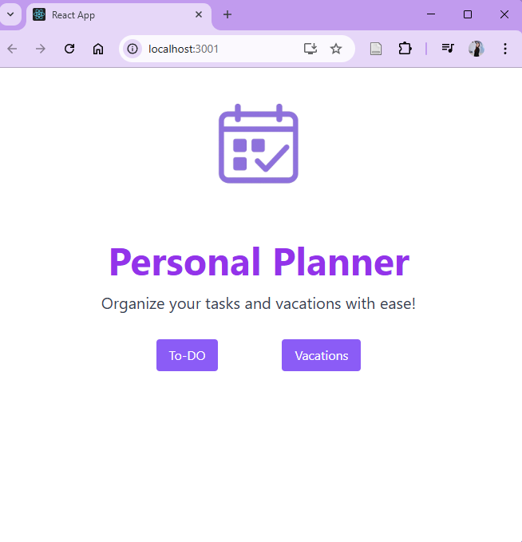
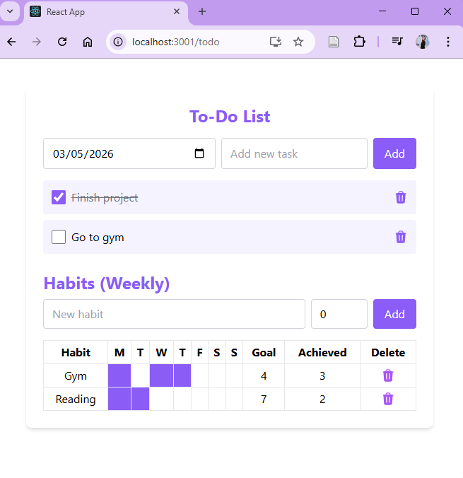
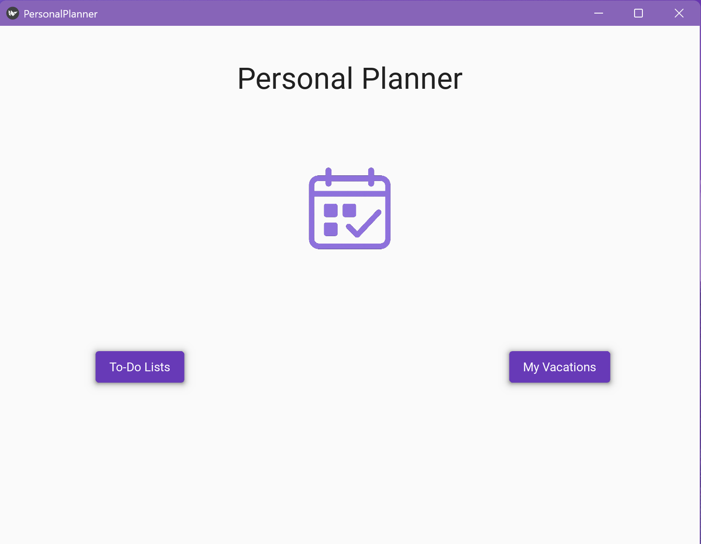
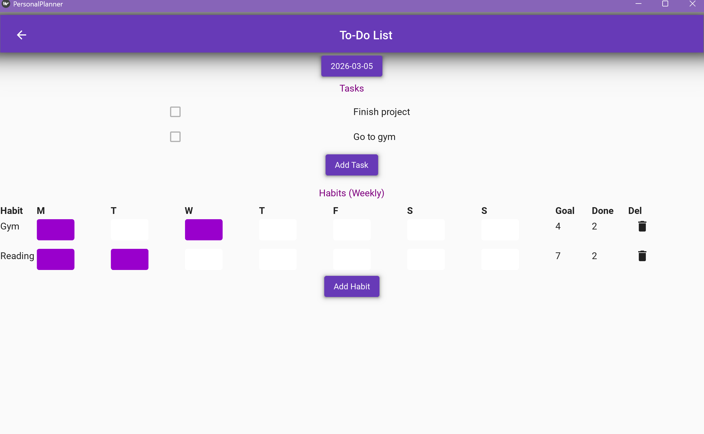
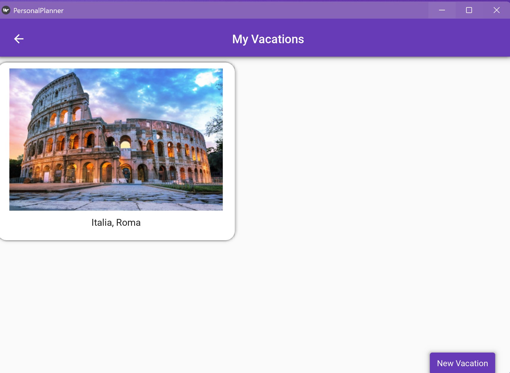
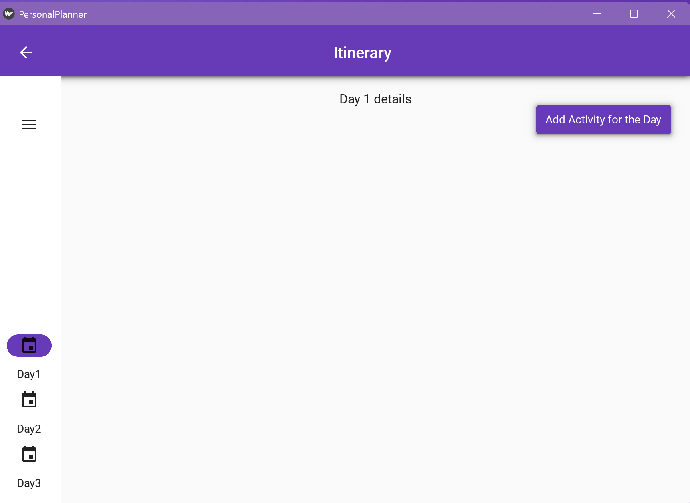
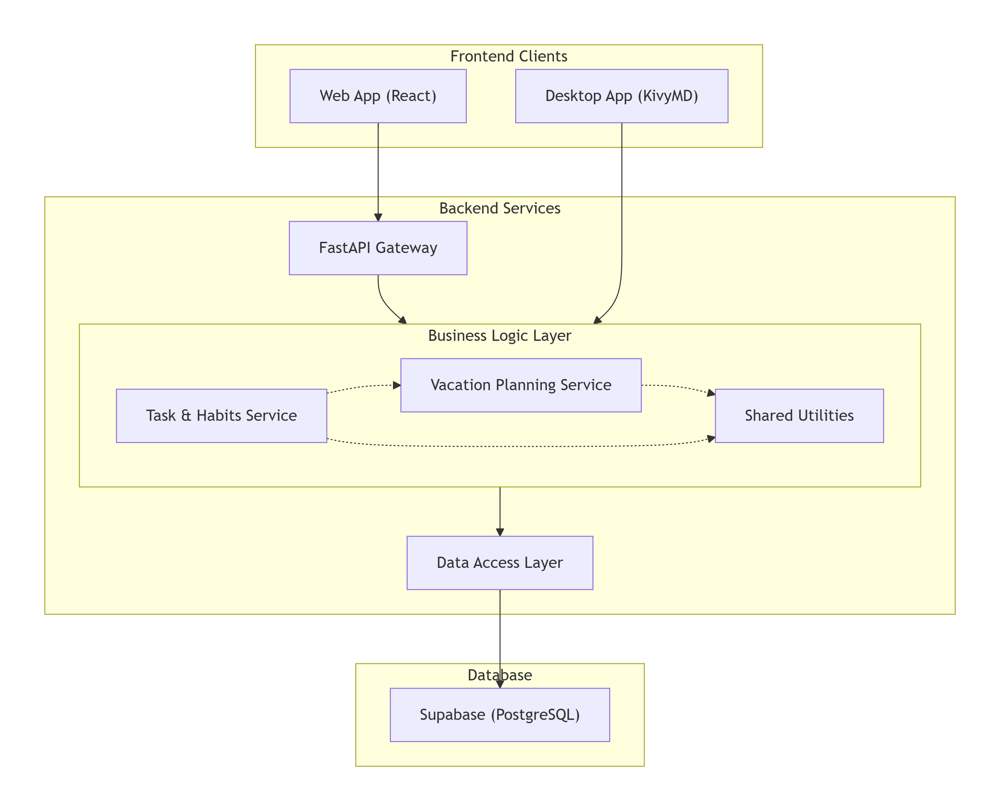

# 📝Personal Planner App

A planning application for managing daily tasks and weekly habits, including vacation itineraries planning on desktop version.

The project includes:
- a **web version** built with React and FastAPI
- a **desktop version** built with Python and KivyMD
  
Both clients share the same Supabase PostgreSQL database and business logic services.
The web application accesses the database through the FastAPI backend, while the desktop client communicates directly with the database through the service layer.

## 📷Screenshots
### Web version
#### Home Page

#### Tasks&Habits Page

### Desktop version
#### Home Page

#### Tasks&Habits Page

#### Vacations Page

## 🚀Features
Web and desktop version:
- Create and manage daily tasks
- Mark tasks as completed
- Delete tasks
- Track weekly habits
- Toggle habit completion for specific days
  
Desktop version only:
- Plan vacations by creating a date-based itinerary
- Automatically generate a daily planning board based on vacation start and end dates
- Add, edit, and delete activities for each day of the itinerary

## 📊Arhitecture

## 🛠Tech Stack
### Backend
- Python
- FastAPI
- Pydantic

### Web Client
- React
- JavaScript
- React Router

### Desktop Client
- Python
- KivyMD

### Database
- PostgreSQL 

### DevOps
- Docker

## Installation / Testing

This project currently requires access to a Supabase database, which is private. 
Only the developer currently has access, so other users will not be able to fully run the app.
